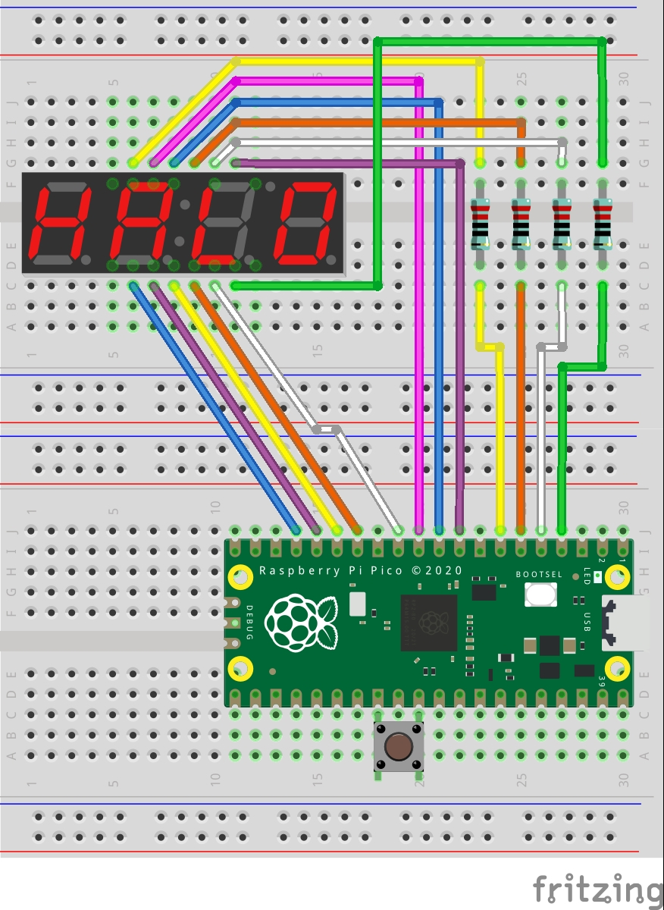

# Raspberry Pi Pico 7 segment timer

## Setup

```bash
rustup self update
rustup update stable
rustup target add thumbv6m-none-eabi
cargo install elf2uf2-rs --locked
cargo install flip-link
```

## Run

```bash
cargo run --release
```

## Required

- Raspberry Pi Pico (1x)
- 4 digits 7 segments display (1x) (OSL40562-LB, Substitution is acceptable.)
- Electrical resistor (4x)
- Tact switch (1x)
- Jumper wire (16x)

### Circuit


